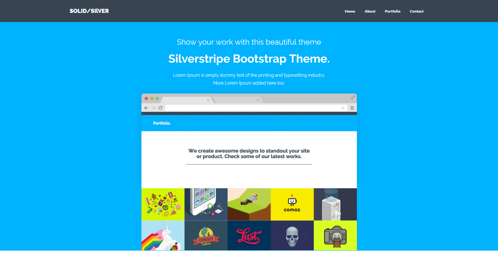

# Using the Solid Silver Theme

<p align="center">


 * Copy the theme into the `themes/` directory of your SilverStripe project.  If you've named it correctly, there should be a directory called `themes/solid-silver/templates`.
 
 * Change the following in your `mysite/config.yml` file.  Change 'theme: 'simple' to 'solid-silver'.
 
 * Add/Create the following  php files in your `mysite/code` folder: 
 
 - AboutPage.php
 - ContactPage.php
 - Page.php
 - Page_Controller.php
 - PorfoilioPage.php
 - PortfolioItem.php
 


# Add the following to 'Page_Controller.php': 

```php
<?php

class Page_Controller extends ContentController
{
    /**
     * An array of actions that can be accessed via a request. Each array element should be an action name, and the
     * permissions or conditions required to allow the user to access it.
     *
     * <code>
     * array (
     *     'action', // anyone can access this action
     *     'action' => true, // same as above
     *     'action' => 'ADMIN', // you must have ADMIN permissions to access this action
     *     'action' => '->checkAction' // you can only access this action if $this->checkAction() returns true
     * );
     * </code>
     *
     * @var array
     */
    private static $allowed_actions = array(
    );


    
 public function init() {   
  parent::init();
  //Requirements::css("http://fonts.googleapis.com/css?family=Raleway:300,500,900%7COpen+Sans:400,700,400italic");
  Requirements::css($this->ThemeDir()."/css/bootstrap.css");
  Requirements::css($this->ThemeDir()."/css/style.css");
  Requirements::css($this->ThemeDir()."/css/font-awesome.min.css");
  Requirements::javascript($this->ThemeDir()."/js/modernizr.js");
  Requirements::javascript("https://ajax.googleapis.com/ajax/libs/jquery/1.11.0/jquery.min.js");
  Requirements::javascript($this->ThemeDir()."/js/bootstrap.min.js");
  Requirements::javascript($this->ThemeDir()."/js/retina-1.1.0.js");
  Requirements::javascript($this->ThemeDir()."/js/jquery.hoverdir.js");
  Requirements::javascript($this->ThemeDir()."/js/jquery.hoverdir.js");
  Requirements::javascript($this->ThemeDir()."/js/jquery.hoverex.min.js");
  Requirements::javascript($this->ThemeDir()."/js/jquery.prettyPhoto.js");
  Requirements::javascript($this->ThemeDir()."/js/jquery.isotope.min.js");
  Requirements::javascript($this->ThemeDir()."/js/custom.js");   
}
   
    
} ]

```

# Add the following to 'Page.php':

```php
<?php

class Page extends SiteTree
{
    
    private static $db = array(
       
    );

    private static $has_one = array(
    'HomeIntroImg' => 'Image',
    );
    
 
    
public function getCMSFields() {
    
$fields = parent::getCMSFields();
   
    
    $fields->addFieldToTab('Root.Attachments', $HomeIntroImg= UploadField::create('HomeIntroImg'));
    $HomeIntroImg->getValidator()->setAllowedExtensions(array('png','gif','jpg','svg'));
    $HomeIntroImg->setFolderName('img/home');
    

    
return $fields;
    
}    
    
    
}

```

# Add the following to 'AboutPage.php':

```php
<?php
    
class AboutPage extends Page {
    
private static $db = array(
  'MoreAbout' => 'HTMLText',
  'TeamInfo1' => 'HTMLText',
  'TeamInfo2' => 'HTMLText',
  'TeamInfo3' => 'HTMLText',
  'TeamInfo4' => 'HTMLText',
  'Testimonial1' => 'HTMLText',     
);
    
private static $has_one = array (
    'AboutPhoto' => 'Image',
    'TeamPhoto1' => 'Image',
    'TeamPhoto2' => 'Image',
    'TeamPhoto3' => 'Image',   
    'TeamPhoto4' => 'Image',    
);     
    
public function getCMSFields() {
    
$fields = parent::getCMSFields();
    
    $fields->addFieldToTab('Root.Main', TextareaField::create('MoreAbout','More About'), 'Content'); 
    $fields->addFieldToTab('Root.Main', TextareaField::create('TeamInfo1','Team Info 1'), 'Content'); 
    $fields->addFieldToTab('Root.Main', TextareaField::create('TeamInfo2','Team Info 2'), 'Content'); 
    $fields->addFieldToTab('Root.Main', TextareaField::create('TeamInfo3','Team Info 3'), 'Content'); 
    $fields->addFieldToTab('Root.Main', TextareaField::create('TeamInfo4','Team Info 4'), 'Content');       
    
    $fields->addFieldToTab('Root.Attachments', $AboutPhoto = UploadField::create('AboutPhoto'));
    $AboutPhoto->getValidator()->setAllowedExtensions(array('png','gif','jpg','svg'));
    $AboutPhoto->setFolderName('img/about');
    
    $fields->addFieldToTab('Root.Attachments', $TeamPhoto1 = UploadField::create('TeamPhoto1'));
    $TeamPhoto1->getValidator()->setAllowedExtensions(array('png','gif','jpg','svg'));
    $TeamPhoto1->setFolderName('img/about');
    
    $fields->addFieldToTab('Root.Attachments', $TeamPhoto2 = UploadField::create('TeamPhoto2'));
    $TeamPhoto2->getValidator()->setAllowedExtensions(array('png','gif','jpg','svg'));
    $TeamPhoto2->setFolderName('img/about');    
    
    $fields->addFieldToTab('Root.Attachments', $TeamPhoto3 = UploadField::create('TeamPhoto3'));
    $TeamPhoto3->getValidator()->setAllowedExtensions(array('png','gif','jpg','svg'));
    $TeamPhoto3->setFolderName('img/about'); 
    
    $fields->addFieldToTab('Root.Attachments', $TeamPhoto4 = UploadField::create('TeamPhoto4'));
    $TeamPhoto4->getValidator()->setAllowedExtensions(array('png','gif','jpg','svg'));
    $TeamPhoto4->setFolderName('img/about');       
    
    $fields->addFieldToTab('Root.Main', TextareaField::create('Testimonial1','Testimonial'), 'Content');   
    
    
return $fields;
    
}  
    
}

class AboutPage_Controller extends Page_Controller {

}
```


# Add the following to 'PorfoilioPage.php':

```php
<?php
    
class PortfolioPage extends Page {

    private static $allowed_children = array ('PortfolioItem');
    //private static $can_be_root = false;
    
}

class PortfolioPage_Controller extends Page_Controller {

}
```


# Add the following to 'PortfolioItem.php': 

```php
<?php
    
class PortfolioItem extends Page {

private static $db = array(
  'ProjectName' => 'HTMLText',
  'Proposal' => 'HTMLText',
  'ProjectDetail' => 'HTMLText',    

); 

private static $has_one = array (
    'ProjectPhoto' => 'Image',
    'ProjectSlider1' => 'Image',
    'ProjectSlider2' => 'Image',
    'ProjectSlider3' => 'Image',
);  
        
private static $can_be_root = false;
   
public function getCMSFields() {
$fields = parent::getCMSFields();
    
    $fields->addFieldToTab('Root.Main', TextareaField::create('ProjectName','Your project name'), 'Content'); 
    $fields->addFieldToTab('Root.Main', TextareaField::create('Proposal','Proposal'), 'Content');
    $fields->addFieldToTab('Root.Main', TextareaField::create('ProjectDetail','Project detail'), 'Content');
    
    $fields->addFieldToTab('Root.Attachments', $ProjectPhoto = UploadField::create('ProjectPhoto'));
    $ProjectPhoto->getValidator()->setAllowedExtensions(array('png','gif','jpg','svg'));
    $ProjectPhoto->setFolderName('img/portfolio');
    
    $fields->addFieldToTab('Root.Attachments', $ProjectSlider1= UploadField::create('ProjectSlider1'));
    $ProjectSlider1->getValidator()->setAllowedExtensions(array('png','gif','jpg','svg'));
    $ProjectSlider1->setFolderName('img/portfolio'); 
    
    $fields->addFieldToTab('Root.Attachments', $ProjectSlider2= UploadField::create('ProjectSlider2'));
    $ProjectSlider2->getValidator()->setAllowedExtensions(array('png','gif','jpg','svg'));
    $ProjectSlider2->setFolderName('img/portfolio'); 
    
    $fields->addFieldToTab('Root.Attachments', $ProjectSlider3= UploadField::create('ProjectSlider3'));
    $ProjectSlider3->getValidator()->setAllowedExtensions(array('png','gif','jpg','svg'));
    $ProjectSlider3->setFolderName('img/portfolio'); 
    
return $fields;
}  
    
    
    
}

class PortfolioItem_Controller extends Page_Controller {

}
```


# Add the following to 'ContactPage.php': 

```php
<?php
    
class ContactPage extends Page {
    
private static $db = array(
  'ContactFormIntro' => 'HTMLText',    
  'ContactAddress' => 'HTMLText',  
);   
    
    
public function getCMSFields() {
    
    $fields = parent::getCMSFields();
    $fields->addFieldToTab('Root.Main', TextareaField::create('ContactFormIntro','Contact Form Intro'), 'Content'); 
    $fields->addFieldToTab('Root.Main', TextareaField::create('ContactAddress','Our Address'), 'Content'); 


return $fields;
    
}  
    
}


class ContactPage_Controller extends Page_Controller {
    
    private static $allowed_actions = array('Form');
    public function Form() { 
        
        
        
        $fields = new FieldList( 
            new TextField('Name'), 
            new EmailField('Email'), 
            new TextField('Subject'), 
            new TextareaField('Message')
        ); 
        $actions = new FieldList( 
            new FormAction('submit', 'Submit') 
        ); 
     $validator = new RequiredFields('Name', 'Email', 'Message','Subject');
    return new Form($this, 'Form', $fields, $actions, $validator); 
    }
    
    public function submit($data, $form) { 
        $email = new Email(); 

        $email->setTo('info@digitaltree.co.nz'); 
        $email->setFrom($data['Email']); 
        $email->setSubject("Contact Message from {$data["Name"]}"); 

        $messageBody = " 
            <p><strong>Name:</strong> {$data['Name']}</p> 
            <p><strong>Subject:</strong> {$data['Subject']}</p> 
            <p><strong>Message:</strong> {$data['Message']}</p> 
        "; 
        $email->setBody($messageBody); 
        $email->send(); 
        return array(
            'Content' => '<p>Thank you for your feedback.</p>',
            'Form' => '<h3>You message has been sent.</h3>'
        );
    }
    
}
```

# Build Database: 

```
Add this in your browser address bar: http://localhost/yoursite/dev/build/?flush

```

# Setup Home Page on CMS : 

```
Go to the admin page: http://localhost/yoursite/admin to access CMS.

Select 'Home page' > Click on 'Settings' > Select 'Home Page" from 'Page type' dropdown list.

Click on 'Content' > Change 'Page name' to 'Home' >

Add the following in 'Services1':

<i class="fa fa-heart-o"></i>
<h4>Handsomely Crafted</h4>
<p>Lorem Ipsum is simply dummy text of the printing and typesetting industry. Lorem Ipsum has been the industry's standard dummy text ever since the 1500s, when an unknown printer took a galley of type and scrambled it to make a type specimen book.</p>
<p><br><a href="about-us" class="btn btn-theme ss-broken">More Info</a></p>.

Add the following in 'Services2':

<i class="fa fa-flask"></i>
<h4>Retina Ready</h4>              
<p>Lorem Ipsum is simply dummy text of the printing and typesetting industry. Lorem Ipsum has been the industry's standard dummy text ever since the 1500s, when an unknown printer took a galley of type and scrambled it to make a type specimen book.</p>
<p><br><a href="portfolio-page" class="btn btn-theme ss-broken">More Info</a></p>

Add the following in 'Services3':

<i class="fa fa-trophy"></i>
<h4>Quality Theme</h4>
<p>Lorem Ipsum is simply dummy text of the printing and typesetting industry. Lorem Ipsum has been the industry's standard dummy text ever since the 1500s, when an unknown printer took a galley of type and scrambled it to make a type specimen book.</p>
<p><br><a href="contact-us" class="btn btn-theme ss-broken">More Info</a></p>            

Add the following in 'More About':

<h4>More About Our Agency.</h4>
<p>Lorem Ipsum is simply dummy text of the printing and typesetting industry. Lorem Ipsum has been the industry's standard dummy text ever since the 1500s, when an unknown printer took a galley of type and scrambled it to make a type specimen book. It has survived not only five centuries, but also the leap into electronic typesetting, remaining essentially unchanged. </p>
<p><br><a href="about-us" class="btn btn-theme">More Info</a></p>

Add the following in 'FAQ':

<h4>Frequently Asked</h4>
<div class="hline"></div>
<p><a href="#" class="ss-broken">How cool is this theme?</a></p>
<p><a href="#" class="ss-broken">Need a nice good-looking site?</a></p>
<p><a href="#" class="ss-broken">Is this theme retina ready?</a></p>
<p><a href="#" class="ss-broken">Which version of Font Awesome uses?</a></p>
<p><a href="#" class="ss-broken">Free support is integrated?</a></p>

Add the following in 'Latest Posts':

<h4>Latest Posts</h4>
<div class="hline"></div>
<p><a href="single-post.html">Our new site is live now.</a></p>
<p><a href="single-post.html">Retina ready is not an option.</a></p>
<p><a href="single-post.html">Bootstrap 3 framework is the best.</a></p>
<p><a href="single-post.html">You need this theme, buy it now.</a></p>
<p><a href="single-post.html">This theme is what you need.</a></p>

Add the following in 'Content':

<h3>Show your work with this beautiful theme</h3>
<h1>Silverstripe Bootstrap Theme.</h1>
<h5>Lorem Ipsum is simply dummy text of the printing and typesetting industry.</h5>
<h5>More Lorem Ipsum added here too.</h5>


Click on 'Attachments' > 

'Home Intro Img" - Choose image file 'browser.png' - \themes\solid-silver\img

FYI: 

'LATEST WORKS' will be populated when you add portfolio pages.


```
